# ASHA Copilot AI — PPT Diagrams & Visual References

> All diagrams below use **Mermaid** syntax fully compatible with **Typora**. Open this file in Typora to see all diagrams rendered live. To export for PowerPoint, use **Typora → File → Export → PDF/HTML** or right-click any diagram → **Copy as Image**.

---

## 1. System Architecture Diagram (Slide 6)

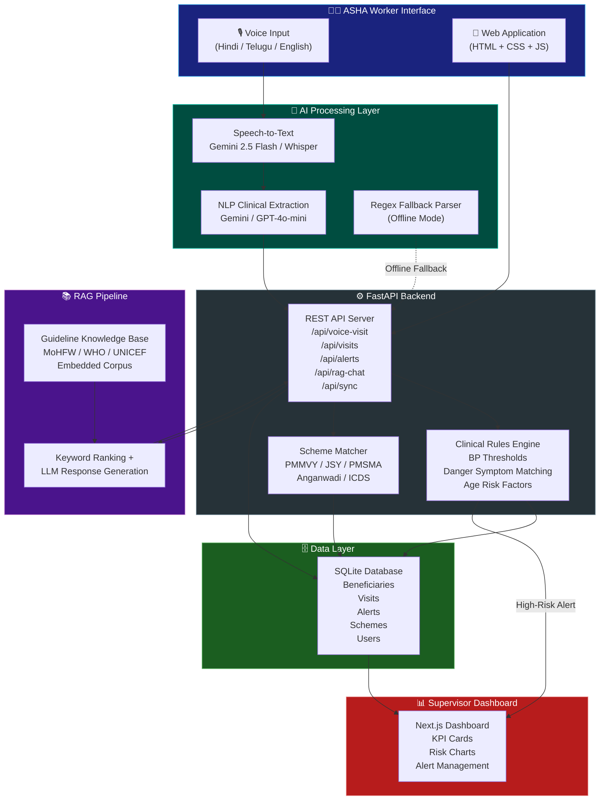

---

## 2. User Journey / Workflow Diagram (Slide 8)

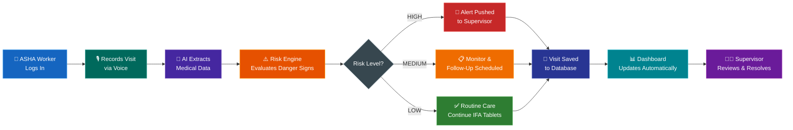

---

## 3. Voice Processing Pipeline (Slide 6 — Detail)

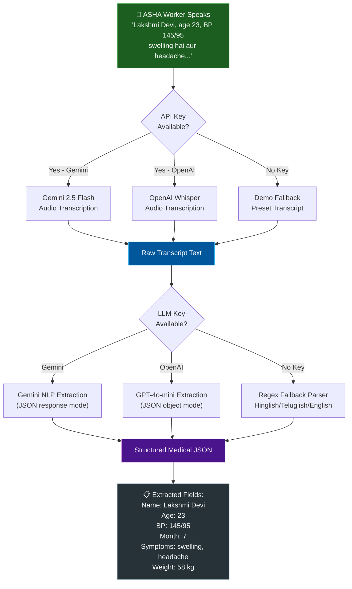

---

## 4. Clinical Rules Engine Logic (Slide 6 — Detail)

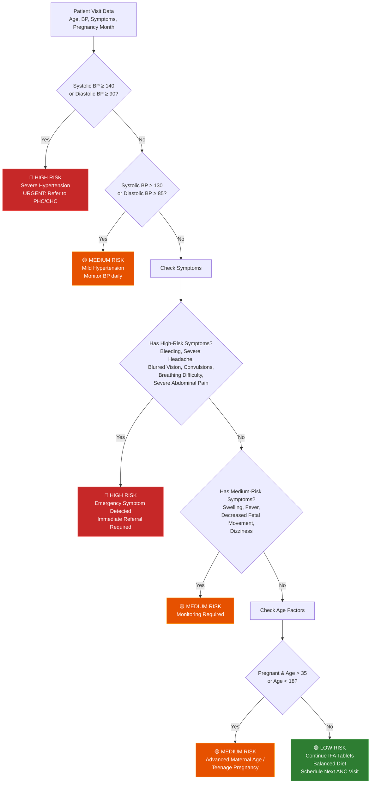

---

## 5. RAG Guideline Assistant Pipeline (Slide 6 — Detail)

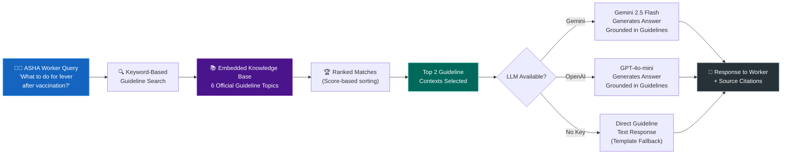

---

## 6. Database Schema Diagram (Slide 7 — Technical Reference)

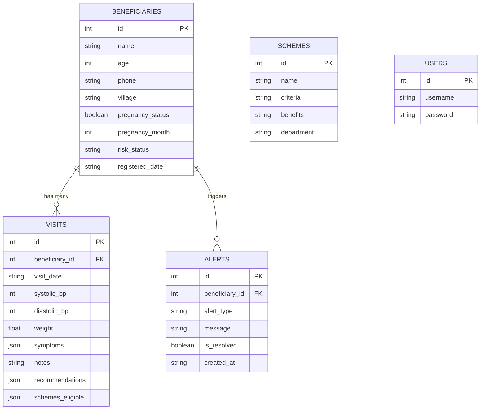

---

## 7. Offline Sync Architecture (Slide 6 — Detail)

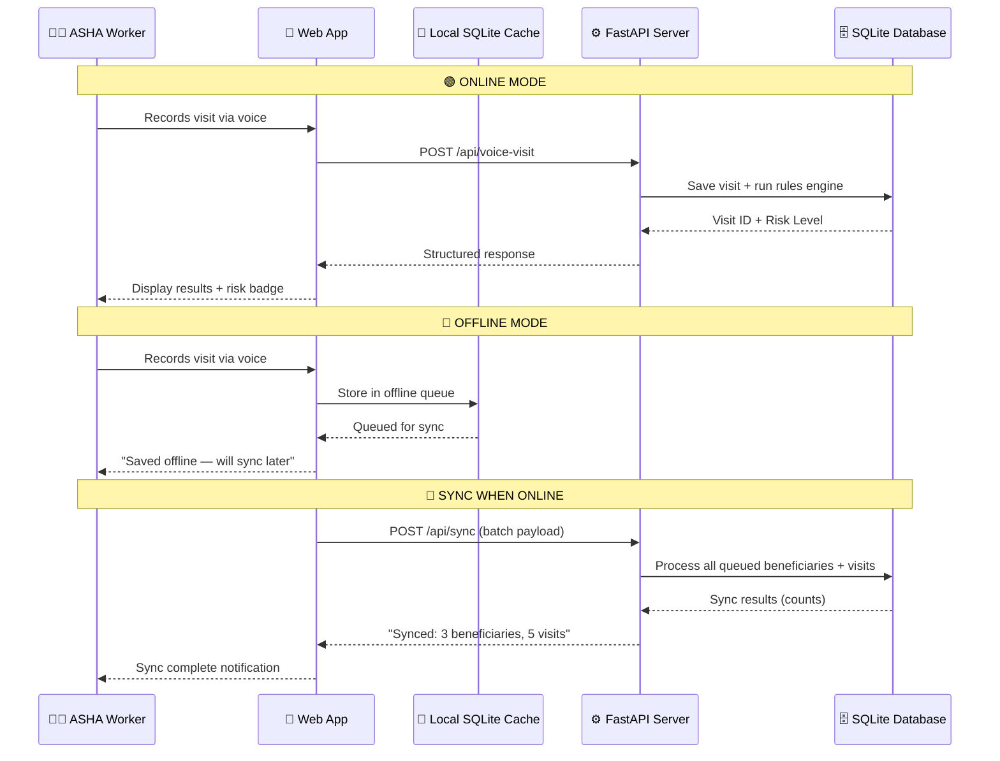

---

## 8. Government Scheme Matching Logic (Slide 5 — Feature Detail)

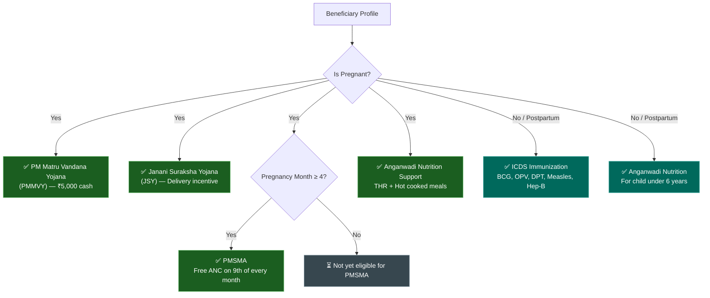

---

## 9. Supervisor Dashboard KPI Layout (Slide 11 — Reference)

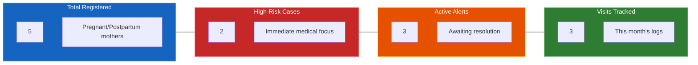

---

## 10. Technology Stack Visual (Slide 7 — Alternative)

```mermaid
graph TB
    ROOT(("ASHA Copilot<br/>Tech Stack"))

    ROOT --> FE["Frontend"]
    ROOT --> BE["Backend"]
    ROOT --> AINLP["AI & NLP"]
    ROOT --> DB["Database"]
    ROOT --> RAGP["RAG Pipeline"]
    ROOT --> CE["Clinical Engine"]

    FE --> FE1["HTML5 + CSS3 + JS"]
    FE --> FE2["Next.js Dashboard"]
    FE --> FE3["Dark Theme UI"]
    FE --> FE4["Responsive Design"]

    BE --> BE1["FastAPI Python"]
    BE --> BE2["REST APIs"]
    BE --> BE3["Pydantic Validation"]
    BE --> BE4["CORS Middleware"]
    BE --> BE5["Uvicorn ASGI"]

    AINLP --> AI1["Gemini 2.5 Flash"]
    AINLP --> AI2["OpenAI Whisper"]
    AINLP --> AI3["GPT-4o-mini"]
    AINLP --> AI4["Regex Fallback"]

    DB --> DB1["SQLite Primary"]
    DB --> DB2["SQLite Offline Cache"]
    DB --> DB3["JSON Storage"]

    RAGP --> R1["Keyword Ranking"]
    RAGP --> R2["Guideline Corpus"]
    RAGP --> R3["LLM Generation"]
    RAGP --> R4["Source Citations"]

    CE --> CE1["BP Thresholds"]
    CE --> CE2["Symptom Matching"]
    CE --> CE3["Age Risk Factors"]
    CE --> CE4["Scheme Eligibility"]

    style ROOT fill:#0d47a1,stroke:#42a5f5,color:#fff
    style FE fill:#1565c0,stroke:#42a5f5,color:#fff
    style BE fill:#00695c,stroke:#4db6ac,color:#fff
    style AINLP fill:#4527a0,stroke:#9575cd,color:#fff
    style DB fill:#1b5e20,stroke:#66bb6a,color:#fff
    style RAGP fill:#6a1b9a,stroke:#ab47bc,color:#fff
    style CE fill:#e65100,stroke:#ff9800,color:#fff
```

---

## 11. Feature Comparison Matrix (Slide 3 — Enhancement)

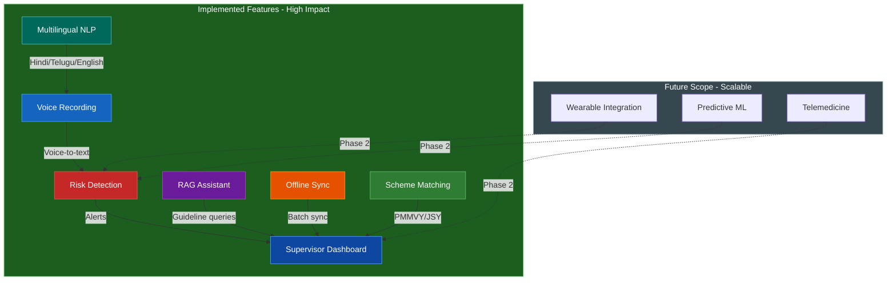

---

> **How to use these diagrams in Typora:**
> 1. Open this file in **Typora** — all diagrams render automatically
> 2. To copy a diagram as image: **Right-click the diagram → Copy as Image**
> 3. To export all diagrams: **File → Export → PDF** or **File → Export → HTML**
> 4. For PowerPoint: Export as HTML, then screenshot individual diagrams, or use **Copy as Image** for each
> 5. For higher quality: Paste the Mermaid code at [mermaid.live](https://mermaid.live) and export as SVG

