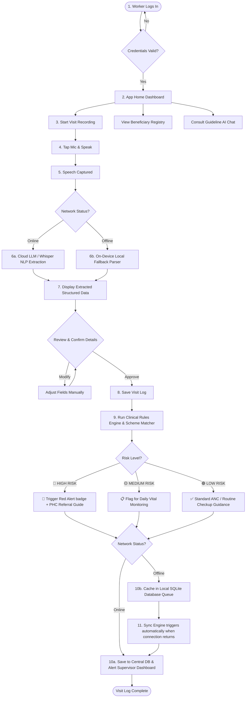

# ASHA Copilot AI — Android App User Flow & Features

ASHA Copilot AI is an AI-powered, multilingual healthcare assistant designed to empower **Accredited Social Health Activists (ASHA)** in rural India. It eliminates manual paperwork, overcomes digital literacy and language barriers, and flags clinical risk factors in real time, even without an internet connection.

---

## 📱 User Persona: ASHA Worker
* **Age/Background:** 25–45 years old, resident of the rural community.
* **Device:** Budget Android smartphone.
* **Connectivity:** Unstable, intermittent, or no cellular data in deep-rural areas.
* **Primary Language:** Speaks local dialects or languages (Hindi, Telugu, etc.) with limited English proficiency.

---

## 🚀 Key Features

### 1. 🎙️ Voice-to-Text Visit Recording (Multilingual)
* **What it does:** Allows the ASHA worker to simply speak details of a patient visit rather than type or fill long forms.
* **Supported Languages:** Hindi, Telugu, and English (including hybrid dialects like Hinglish or Teluglish).
* **Benefit:** Bridges the digital literacy gap; makes recording a patient visit as easy as talking.

### 2. 🧠 AI-Powered Clinical Data Extraction (NLP)
* **What it does:** Parses the transcript of the natural spoken narrative into structured patient records.
* **Fields Extracted:** Name, Age, Gestational/Pregnancy Month, Blood Pressure (Systolic & Diastolic), Symptoms, and Weight.
* **Backup Mode:** Includes a lightweight, local, regex-based fallback extractor that runs instantly on-device when offline (no LLM connection needed).

### 3. 🚨 Real-Time Clinical Risk Rules Engine
* **What it does:** Automatically analyzes extracted patient metrics against standard maternal health guidelines.
* **Risk Levels:**
  * 🟢 **Low Risk:** Routine care, standard iron & folic acid (IFA) supplements, balanced diet advice.
  * 🟡 **Medium Risk:** Adolescent pregnancy, advanced maternal age (>35), or mild pre-hypertension. Daily monitoring is advised.
  * 🔴 **High Risk (Obstetric Emergency):** BP $\ge 140/90$ mmHg, or danger signs such as bleeding, severe headache, blurred vision, convulsions, severe abdominal pain, or breathing difficulties.
* **Action:** Recommends immediate action (e.g., *"URGENT: Refer immediately to nearest PHC/CHC"*).

### 4. 🔄 Offline-First Sync Engine (Local Cache)
* **What it does:** Saves all beneficiary registrations and patient check-ups locally inside the SQLite database on the device when offline.
* **Sync Mechanism:** Automatically registers a background worker that checks for network connectivity and batches pending records to the supervisor portal once internet is restored.

### 5. 🏥 Government Scheme Recommendation Engine
* **What it does:** Matches beneficiary profiles to financial and nutrition benefits in real time:
  * **PMMVY (Pradhan Mantri Matru Vandana Yojana):** Cash incentive of ₹5,000 for first-time mothers.
  * **JSY (Janani Suraksha Yojana):** Institutional delivery incentives.
  * **PMSMA (Pradhan Mantri Surakshit Matritva Abhiyan):** Free ANC services on the 9th of every month.
  * **Anganwadi Nutrition / ICDS Support:** Free Take-Home Rations (THR) and nutritional supplements.

### 6. 📚 RAG-Powered Guideline Assistant
* **What it does:** A conversational AI assistant grounded in official MoHFW (Ministry of Health and Family Welfare), WHO, and UNICEF handbooks.
* **Usage:** Instant answers on demand for vaccine reactions, infant nutrition, breastfeeding practices, and managing childhood illnesses (SAM/MAM).

---

## 🔄 User Journey & Flow

### Step-by-Step User Flow Details

1. **Authentication:**
   The ASHA worker launches the app and logs in securely using their assigned credentials.
   
2. **Main Dashboard:**
   Offers quick-action shortcuts:
   * **Record Visit** (Primary action button).
   * **Maternal Registry** (List of registered pregnant women, sorted by risk status).
   * **Guideline Chat** (RAG assistant for instant queries).
   * **Sync Status** (Shows pending items to be uploaded).

3. **Patient Visit Logging:**
   * The worker selects an existing patient or starts a fresh entry.
   * Clicks the microphone button and records a natural spoken narrative (e.g., *"Sita Devi, age 26, 6th month, BP 120/80, no symptoms, weight 54kg"*).
   * The application processes the audio locally or via API to fill in the form fields dynamically.
   * The worker reviews the populated fields, edits any minor errors, and taps **Save**.

4. **Instant Diagnostic Rules Check:**
   * The system immediately computes gestational risk, updates the patient profile indicator (Green/Yellow/Red), and shows matching government programs.
   * If flagged **High Risk**, the app displays an alert pop-up with immediate local action items (e.g., referral steps) and generates a notification for the PHC (Primary Health Centre) supervisor.

5. **Guideline Lookup (RAG Chat):**
   * If the worker encounters a child with fever post-immunization or needs information on addressing severe acute malnutrition, they open the Chat tab.
   * They type or ask via voice, and the system retrieves verified textbook guidelines.

6. **Offline Sync Handling:**
   * If the village has no network, the app seamlessly runs in **Offline Mode**.
   * It stores all visits locally. A badge on the dashboard shows: `Sync Queue: 4 pending`.
   * When the worker reaches a network-connected zone, the background sync pushes the cached data to the central database, clearing the queue.
